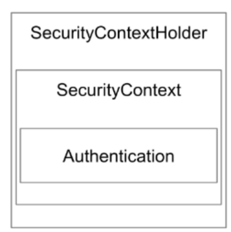
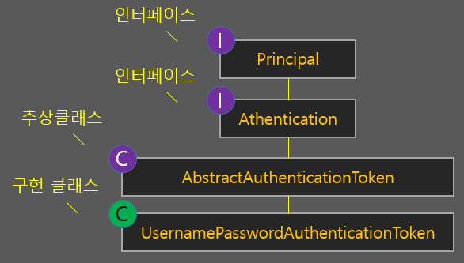

# spring-instagram-20th
CEOS 20th BE study - instagram clone coding

## 5주차
### Spring Security 주요 객체
- SecurityContextHolder, SecurityContext, Authentication

  

  Authentication 객체에는 principal(아이디; username), credential(비밀번호; password) 정보
  
    ```java
    // Security에 로그인한 사용자의 정보를 얻기 위해선
    SecurityContextHolder.getContext().getAuthentication().getPrincipal(); 
    ```
- AbstractAuthenticationProcessingFilter.java
    ```java
    public abstract class AbstractAuthenticationProcessingFilter extends GenericFilterBean implements ApplicationEventPublisherAware, MessageSourceAware {

        public abstract Authentication attemptAuthentication(HttpServletRequest request, HttpServletResponse response) throws AuthenticationException, IOException, ServletException;

        protected void successfulAuthentication(HttpServletRequest request, HttpServletResponse response, FilterChain chain, Authentication authResult) throws IOException, ServletException { }

        protected void unsuccessfulAuthentication(HttpServletRequest request, HttpServletResponse response, AuthenticationException failed) throws IOException, ServletException { }
    ```
    인증 필터로 주로 위 3가지 메서드를 구현하게 되며
    
    주로  이 필터를 구현한 UsernamePasswordAuthenticationFilter를 사용하고 이를 오버라이딩하게 된다.
    
- AbstractAuthenticationToken
  
  Authentication(인증)을 구현한 클래스
  
  Authenticaton 객체를 구현한 AbstractAuthenticationToken 추상클래스가 있고 이를 상속한 UsernamePasswordAuthenticationToken 존재
    ```java
    public class UsernamePasswordAuthenticationToken extends AbstractAuthenticationToken {
    private static final long serialVersionUID = 620L;
    private final Object principal;
    private Object credentials;
    
  // 아직 인증되지 않은 객체 생성
    public UsernamePasswordAuthenticationToken(Object principal, Object credentials) {
        super((Collection)null);
        this.principal = principal;
        this.credentials = credentials;
        this.setAuthenticated(false);
    }
    // 모든 인증 완료되면 인증된 생성자로 객체 생성
    public UsernamePasswordAuthenticationToken(Object principal, Object credentials, Collection<? extends GrantedAuthority> authorities) {
        super(authorities);
        this.principal = principal;
        this.credentials = credentials;
        super.setAuthenticated(true);
    }

    public static UsernamePasswordAuthenticationToken unauthenticated(Object principal, Object credentials) {
        return new UsernamePasswordAuthenticationToken(principal, credentials);
    }

    public static UsernamePasswordAuthenticationToken authenticated(Object principal, Object credentials, Collection<? extends GrantedAuthority> authorities) {
        return new UsernamePasswordAuthenticationToken(principal, credentials, authorities);
    }

    public Object getCredentials() {
        return this.credentials;
    }

    public Object getPrincipal() {
        return this.principal;
    }

    public void setAuthenticated(boolean isAuthenticated) throws IllegalArgumentException {
        Assert.isTrue(!isAuthenticated, "Cannot set this token to trusted - use constructor which takes a GrantedAuthority list instead");
        super.setAuthenticated(false);
    }

    public void eraseCredentials() {
        super.eraseCredentials();
        this.credentials = null;
    }
  ```

- AuthenticationManger 
  여러 AuthenticatonProvider(인증공급자)를 관리하고 인증 요청을 처리하는 인터페이스
  
    인증객체토큰을 Provider에게 받아서 AuthenticationFilter에게 return
    
    ```java
    Authentication authenticate(Authentication authentication) throws AuthenticationException;
    ```
    Authentication 객체를 통해 인증 수행하는 메서드 구현

- AuthenticationProvider
  인증 프로세스를 담당하는 인터페이스
  
    로직 실행 뒤 인증 객체 토큰을 AuthenticationManger에게 return
    ```java
    // Authentication 객체를 통해 사용자 이름과 비밀번호 확인후 성공 시 인증된 Authentication 객체 반환
    Authentication authenticate(Authentication authentication) throws AuthenticationException;
  
    // AuthenticationProvider가 특정 인증 클래스 지원하는지 확인
    boolean supports(Class<?> authentication);
    ```
- UserDetailsService
    
    사용자 이름으로 사용자 세부 정보를 검색하는 객체
- UserDetails
    
    스프링 시큐리티가 관리하는 사용자 객체

### securityConfig 설정
```java
@Bean
    public BCryptPasswordEncoder bCryptPasswordEncoder(){

        return new BCryptPasswordEncoder();
    }
```

```java
    // 시큐리티 필터 설정
    @Bean
    public SecurityFilterChain filterChain(HttpSecurity http, JwtUtil jwtUtil) throws Exception {
        final String[] ALL_URL = new String[]{"/accounts/login", "/accounts/user/signup"};
        // CSRF 보호 기능을 비활성화
        http
                .csrf((auth) -> auth.disable());
        // 폼 로그인 비활성화
        http    
                .formLogin((auth) -> auth.disable());
        // 리소스(URL)의 권한 설정
        http
                .authorizeHttpRequests((auth) -> auth
                        .requestMatchers(ALL_URL).permitAll()
                        .anyRequest().authenticated());
        // 세션 관리 설정
        http
                .sessionManagement((session) -> session.sessionCreationPolicy(SessionCreationPolicy.STATELESS));
        
        return http.build();


    }
```
csrf: Cross Site Request Forgery, 의도치 않은 위조 요청을 보냈을 때 csrf protection을 적용하면 html에서 csrf 토큰이 포함되어 있어야 요청을 받아들이게 함으로써 위조 요청 방지

Spring security는 csrf protection을 제공하지만 disable!

요즘 rest api를 이용하는 서버스는 session 기반 인증과 달리 토큰 방식을 사용! 따라서 stateless하기 때문에 따로 서버에 인증 정보를 보관하지 않음!
```java
    // authenticationManger를 Bean 등록
    @Bean
    public AuthenticationManager authenticationManager(AuthenticationConfiguration authenticationConfiguration) throws Exception {
        return authenticationConfiguration.getAuthenticationManager();
    }
```
### 회원가입 구현
```java
public class AuthService implements UserDetailsService {
    private final BCryptPasswordEncoder bCryptPasswordEncoder;
    private UserRepository userRepository;

    @Transactional
    public User create(JoinRequestDto joinRequestDto) {
        String nickname = joinRequestDto.getNickname();
        Boolean isExist = userRepository.existsByNickname(nickname);
        if (isExist) throw new BadRequestException(ExceptionCode.ALREADY_EXIST_NICKNAME);

        String encPassword = bCryptPasswordEncoder.encode(joinRequestDto.getPassword());
        User user = joinRequestDto.toEntity(joinRequestDto, encPassword);

        return userRepository.save(user);

    }
}
```
=> 회원가입 후 유저 정보가 전부 response로 들어감

### 로그인 구현
JwtAuthenticationFilter -> 인증 수행에 대한 filter
```java
@Slf4j
public class JwtAuthenticationFilter extends UsernamePasswordAuthenticationFilter {
    // nickname과 password를 통해 로그인 시도
    @Override
    public Authentication attemptAuthentication(HttpServletRequest request, HttpServletResponse response) throws AuthenticationException {
        String contentType = request.getContentType();
        String nickname = "";
        String password = "";
        // JSON 형식에서 사용하는 방식으로 로그인
        if(contentType.equals(MediaType.APPLICATION_JSON_VALUE)){
            try {
                LoginRequestDto loginRequest = new ObjectMapper().readValue(request.getReader(), LoginRequestDto.class);
                nickname = loginRequest.getNickname();
                password = loginRequest.getPassword();
            } catch (IOException e) {
                throw new AuthenticationServiceException("잘못된 key, name으로 요청했습니다.", e);
            }
        }
        //HTML 폼에서 사용하는 방식으로 로그인
        else if(contentType.equals(MediaType.APPLICATION_FORM_URLENCODED_VALUE)) {
            nickname = this.obtainPassword(request);
        }
        
        // 인증되기 전, 인증 객체 생성
        UsernamePasswordAuthenticationToken unauthenticated = new UsernamePasswordAuthenticationToken(nickname, password);
        //인증 매니저를 통해  인증 처리 -> 유효할 경우 Authentication 객체를 반환
        return super.getAuthenticationManager().authenticate(unauthenticated);
    }
    
    // 인증 성공 시 실행하는 메서드
    @Override
    protected void successfulAuthentication(HttpServletRequest request, HttpServletResponse response, FilterChain chain,Authentication authResult) throws IOException, ServletException {
        log.info("Security Login >> 인증 성공");
        final String nickname = authResult.getName();

        AuthenticationSuccessHandler handler = this.getSuccessHandler();
        handler.onAuthenticationSuccess(request, response, authResult);
    }

    // 인증 실피 시 실행하는 메서드
    @Override
    protected void unsuccessfulAuthentication(HttpServletRequest request, HttpServletResponse response, AuthenticationException failed) throws IOException, ServletException {
        log.info("Security Login >> 인증 실패");

        AuthenticationFailureHandler handler = this.getFailureHandler();
        handler.onAuthenticationFailure(request, response, failed);
    }
}

```

securityConfig
```java
//로그인 인증 필터
@Bean
    public LoginAuthenticationFilter loginAuthenticationFilter() throws Exception {
        LoginAuthenticationFilter loginAuthenticationFilter = new LoginAuthenticationFilter();
        loginAuthenticationFilter.setAuthenticationManager(authenticationManager(authenticationConfiguration));
        // 로그인 경로 설정, Spring Security는 /login 경로로 요청 처리 -> /accounts/login으로 변경
        loginAuthenticationFilter.setFilterProcessesUrl("/accounts/login");
        // 로그인 성공 했을 때 실행
        loginAuthenticationFilter.setAuthenticationSuccessHandler(loginSuccessHandler); 
        // 로그인 실패 했을 때 실행
        loginAuthenticationFilter.setAuthenticationFailureHandler(loginFailHandler);    
        return loginAuthenticationFilter;
    }

@Bean
public SecurityFilterChain filterChain(HttpSecurity http) throws Exception{
    // CORS 설정
    http.cors((cors -> cors.configurationSource(new CorsConfigurationSource() {
        @Override
        public CorsConfiguration getCorsConfiguration(HttpServletRequest request) {
            CorsConfiguration configuration = new CorsConfiguration();
            // 지정된 도메인과 HTTP 메서드만 허용
            configuration.setAllowedOrigins(List.of(ALLOW_CROSS_ORIGIN_DOMAIN));
            configuration.setAllowedMethods(List.of(ALLOW_METHODS));
            // 모든 HTTP 헤더 허용
            configuration.setAllowedHeaders(Collections.singletonList("*"));
            // 쿠키나 인증 정보를 포함한 요청 허용
            configuration.setAllowCredentials(true);
            // CORS preflight 요청 응답 시간 1시간 동안 캐시
            configuration.setMaxAge(3600L);

        return configuration;
        }
    })));
    // 기존 UsernamePasswordAuthenticationFilter를 대체
    http
          .addFilterAt(loginAuthenticationFilter(), UsernamePasswordAuthenticationFilter.class);
}
```
token을 발급하고 token에서 정보를 추출할 수 있는 JwtUtil
```java
// token 생성
public String generateAccessToken(String nickname, String roles) {
        Claims claims = (Claims) Jwts.claims().setSubject(nickname);
        claims.put("roles", roles);
        Date now = new Date();
        return Jwts.builder()
                .setClaims(claims)
                .claim("type", "access")
                .setIssuedAt(now)
                .setExpiration(new Date(now.getTime() + ACCESS_TOKEN_VALIDITY))
                .signWith(SignatureAlgorithm.HS256, secretKey)
                .compact();
    }

// Request의 Header에서 token 값
public String resolveToken(HttpServletRequest request) {
  return request.getHeader("X-AUTH-TOKEN");
}

// 토큰의 유효성 + 만료일자 확인
public boolean validateToken(String token) {
  try {
    Jws<Claims> claims = Jwts.parser().setSigningKey(secretKey).build().parseClaimsJws(token);
    return !claims.getBody().getExpiration().before(new Date());
  } catch (Exception e) {
    return false;
  }
}
```
인증 성공 / 실패 시 실행하는 handler 구현
```java
@Override
    public void onAuthenticationSuccess(HttpServletRequest request, HttpServletResponse response, Authentication authentication) throws IOException, ServletException {
        UserDetails userDetails = (UserDetails) authentication.getPrincipal();
        String nickname = userDetails.getUsername();

        Collection<? extends GrantedAuthority> authorities = authentication.getAuthorities();
        String role = authorities.stream().findFirst().get().getAuthority();

        // accessToken은 헤더로 refreshToken은 쿠키에 넣어 전달
        String accessToken = jwtUtil.generateAccessToken(nickname, role);
        String refreshToken = jwtUtil.generateRefreshToken(nickname, role);
        
        Cookie refreshTokenCookie = createCookie(refreshToken, "refreshToken");
        response.addHeader("Authorization", "Bearer " + accessToken);

        String jsonResponse = new ObjectMapper().writeValueAsString(new LoginResponseDto(HttpServletResponse.SC_OK, "로그인 성공"));
        response.setContentType(MediaType.APPLICATION_JSON_VALUE);
        response.setCharacterEncoding(StandardCharsets.UTF_8.toString());
        response.setStatus(HttpServletResponse.SC_OK);
        response.getWriter().write(jsonResponse);
        
        response.addCookie(refreshTokenCookie);
    }
```
### Redis
Re
## 4주차
### 1. 인스타그램의 4가지 HTTP Method API
1. 새로운 데이터 생성
```java
@PostMapping
    public ResponseEntity createPost(@RequestBody @Valid PostRequestDto postRequestDto, @RequestParam("nickname") String nickname) {
        postService.create(postRequestDto, nickname);
        return ResponseEntity.status(HttpStatus.CREATED).build();
    }
```
회원가입, 로그인과 같은 기능이 구현이 안되어 있어서 @RequestParam("")을 사용하여 url에서 nickname을 받아 포스트를 저장하는데 사용했습니다.


```java
@Transactional
    public void create(PostRequestDto postRequestDto, final String nickname) {
        final User writer = userRepository.findByNickname(nickname)
                .orElseThrow(()-> new NotFoundException(ExceptionCode.NOT_FOUND_USER));
        writer.increasePostCount();

        final Post post = postRequestDto.toEntity(writer);

        postImageService.uploadImage(post, postRequestDto.getImages());

        postRepository.save(post);
    }
```
nickname 값을 통해서 User를 찾고 postCount 값을 증가시킨 뒤 저장


2. 모든 데이터 get
```java

```

3. 특정 데이터 get


4. 특정 데이터 삭제


### 2. 정적 팩토리 메서드를 사용한 DTO

### 3. Global Exception

### 4. Swagger 연동 후 Controller 통합 테스트

[Swagger란?]
: 


## 3주차
### 1) 인스타그램 서비스 코드 작성
#### 지난 주 코드 개선
**[@Size vs @Column(length=n) vs @Length]**
- @Size

  Java Bean Validation 어노테이션

  필드 크기가 min과 max 사이여야 값을 저장할 수 있도록 유효성 검사를 해줌

  JPA나 Hibernate로부터 독립적인 bean을 만들어주기 때문에
- @Length

  Hibernate 어노테이션으로 min과 max를 이용하여 필드 값 크기에 대한 유효성 검사를 함


- @Column(length=value)

  JPA에서 제공하는 어노테이션으로 유효성 겁사를 해주는 것이 아니라 물리적인 데이터베이스 테이블 컬럼의 길이 속성만 지정된다!

이것도 @NotNull & @Column(nullable=false)와 마찬가지로 DB의 컬럼 속성으로 지정해주는 것보다 아닌 것이 더 안정적이다.


그렇다면 @Size와 @Length의 차이는 무엇일까?

@Size의 경우 문자열, 배열, 컬렉션 등에 사용가능하고

@Length의 경우 문자열만 사용 가능

@Length의 경우 Hibernate의 어노테이션이기 때문에 특정 라이브러리에 대한 의존성을 피하기 위해 사용을 자제하는 것이 좋다고 함


#### 서비스 코드 작성
**[코드 작성 전! 서비스 계층이란?]**
스프링에는 크게 3개의 계층 존재

|Presentation Layer|Business Layer|Data Access Layer|
|---|---|---|
|웹 클라이언트의 요청 및 응답 처리|애플리케이션 비즈니스 로직과 비즈니스와 관련된 도메인 모델의 적합성 검증|ORM(Mybatix, Hibernate)를 주로 사용하는 계층|
|서비스계층, 데이터 엑세스 계층에서 발생하는 Exception을 처리|트랜잭션 관리, 프레젠테이션 계층과 데이터 엑세스 계층 사이를 연결하는 역할로 두 계층의 직접적 통신 방지|Database에 data를 CRUD하는 계층|
|@Controller 어노테이션을 사용하여 작성된 클래스|Service인터페이스와 @Service 어노테이션을 사용하여 작성된 클래스|DAO 인터네이스와 @Repository 어노테이션을 사용하여 작성된 DAO 구현 클래스|

💡DTO란?

계층 간 데이터 교환을 위한 객체 (데이터를 주고 받을 포맷)

-> Domain, VO라고도 부름 / DB에서 데이터를 얻어 Service, Controller 등으로 보낼 때 사용

로직 X, 순수하게 getter, setter 같은 메소드를 가짐

💡DAO란?

DB에 접근하는 객체, DB를 사용해 데이터를 조작하는 기능을 하는 객체

-> Repository라고도 부름(JPA 사용 시 Repository 사용) / Service 계층과 DB를 연결하는 고리


❓ 그래서 이게 무슨말이지?

전체적 구조를 살펴보면...

Client <-> controller <-> Service <-> Repository <-> DB

이런 식으로 작동을 하는데
Repository와 DB 사이에 DAO는 Entity를 이용해 DB에 접근 해 데이터를 조작

그리고 그 외에 각 패키지 구조 사이에서는 DTO를 통해 데이터 교환


❓ 그러면 Entity를 이용해 DTO 역할을 하면 안돼?

구현은 가능하지만 Entity와 DTO를 분리하는게 일반적

1) View Layer와 DB Layer의 역할을 철저하게 분리
2) Entity는 테이블과 매핑되는 클래스이기 때문에 변경 시 여러 클래스에 영향을 주지만 View와 통신하는 DTO는 자주 변경되기 때문


그렇다면 Service를 구현하기 전 DTO 구현 필요!

**[DTO 구현]**
```java
package com.ceos20.instagram.post.dto;

import com.ceos20.instagram.post.domain.Post;
import com.ceos20.instagram.post.domain.PostImage;
import com.ceos20.instagram.user.domain.User;
import lombok.*;

import java.time.LocalDateTime;
import java.util.List;

@Builder
@NoArgsConstructor
@AllArgsConstructor
@Getter
@ToString
public class PostCreateDto {
    private String content;
    private User writer;
    private List<PostImage> images;

    public Post toEntity(String content, User writer) {
        return Post.builder()
                .content(content)
                .writer(writer)
                .build();
    }
}
```

**[service 코드 구현]**
```java
package com.ceos20.instagram.post.service;

import com.ceos20.instagram.post.domain.Post;
import com.ceos20.instagram.post.dto.PostCreateDto;
import com.ceos20.instagram.post.repository.PostImageRepository;
import com.ceos20.instagram.post.repository.PostRepository;
import com.ceos20.instagram.user.repository.UserRepository;
import org.springframework.stereotype.Service;
import org.springframework.transaction.annotation.Transactional;

import java.util.List;

@Service
public class PostService {
    private UserRepository userRepository;
    private PostRepository postRepository;
    private PostImageRepository postImageRepository;

    @Transactional
    public void create(PostCreateDto postCreateDto) {
        Post post = postCreateDto.toEntity(postCreateDto.getContent(), postCreateDto.getWriter());
        postRepository.save(post);
    }

    public Post getPost(Long postId) {
        return postRepository.findPostById(postId)
                .orElseThrow(IllegalAccessError::new);
    }

    public List<Post> getPosts(Long userId) {
        List<Post> posts = postRepository.findPostByWriter_Id(userId);
        if (posts.isEmpty()) {
            throw new IllegalStateException("No post");
        }
        return posts;
    }

    @Transactional
    public void delete(Long postId){
        postRepository.deletePostById(postId);
    }


}

```


## 2주차
### 1) DB 모델링
#### 요구사항
- 게시글 조회
- 게시글에 사진과 함께 글 작성
- 게시글에 댓글 및 대댓글 기능
- 게시글에 좋아요 기능
- 게시글, 댓글, 좋아요 삭제 기능
- 유저 간 1:1 DM 기능

#### 기능 분석
**[User]**
|내 정보 설정 페이지|연락처 추가 페이지|프로필 페이지|
|------|---|---|
||||
|이름, 사용자 이름, 성별, 소개, 프로필|전화번호, 이메일|게시물, 팔로잉, 팔로워 수|

- 계정 생성: 30자 미만 사용자 이름(닉네임) + 패스워드 + 자동으로 가입일자 저장
- 나머지 필드는 계정 생성 이후 수정 가능


**[관계 분석]**

- User와 User 사이 Follow 관계(m:n) - Follow 테이블 생성


**[Post]**
|게시글 조회|게시글 생성|
|------|---|
|||
|작성자, 날짜, 좋아요, 댓글, 스크랩|본문, 해시태그|

- 게시글 생성: 이미지와 본문, 해시태그로 생성 가능
- 게시글 좋아요, 댓글 생성, 스크랩 가능

**[관계 분석]**

- User와 Post 사이 Like 관계(m:n) - Like 테이블 생성
- User와 Post 사이 Scrap 관계(m:n) - Scrap 테이블 생성
- Post와 Hashtag 사이 PostHashtag 관계(m:n) - PostHashtag 테이블 생성


**[Comment]** <br />
 <br />
작성자, 작성일, 본문, 답글, 좋아요

- 댓글 생성: 하나의 게시글 여러개의 댓글 생성 가능
- 답글 작성: 댓글에 여러 답글 작성 가능
- 회원 태그: 유저를 태그
- 댓글 좋아요

**[관계 분석]**

- Post와 Comment 사이 관계 (1:m)
- Comment와 Comment 사이 관계 (1:m) - 답글 ➡️ Comment가 자기자신을 참조
- Comment와 User 사이 Like 관계 (m:n) - CommentLike 테이블 생성
- Comment와 User 사이 CommentUserTag 관계 (m:n) - CommentUserTag 테이블 생성


**[DM]**
|DM 방|DM 관련 기능|
|------|---|
||

- 메시지 전송: 유저 2명이 한 대화방에서 메시지를 주고 받음
- 메시지 공감: 메시지에 공감 표시 가능
- 읽음 여부: 읽음 여부 확인 가능

  **[관계 분석]**

  - User와 DM (m:n) - DMRoom 생성


#### ERD


[👉 ERD 링크](https://www.erdcloud.com/d/fqBpSLZ9cCXL4rbae)

#### 💡구현
```java
package com.ceos20.instagram.user.domain;

import jakarta.persistence.*;
import lombok.*;

import java.time.LocalDateTime;

@Entity
@Builder
@Getter
@AllArgsConstructor
@NoArgsConstructor(access = AccessLevel.PROTECTED)
public class Follow {
    @Id
    @GeneratedValue(strategy = GenerationType.IDENTITY)
    @Column(name = "follow_id")
    private Long id;

    // 팔로우 한 시간
    @Column(nullable = false)
    private LocalDateTime createdAt;

    // 친한 친구 여부
    private Boolean isBestFriend = false;

    // 팔로우 한 유저
    @ManyToOne(fetch = FetchType.LAZY)
    @JoinColumn(name="follower_id")
    private User followerId;

    // 팔로우 당한 유저
    @ManyToOne(fetch = FetchType.LAZY)
    @JoinColumn(name="following_id")
    private User followingId;


}

```

#### 💡연관관계
연관관계 매핑: 객체의 참조와 테이블의 외래키를 매핑하는 것

관계형 데이터베이스에서의 테이블 사이 연관관계 != 객체 지향 프로그램에서의 객체 사이 연관관계

차이를 해소하기 위한 기술: ORM

**[연관관계 매핑 고려사항]**

- **방향**: 단방향 연관관계, 양방향 연관관계
- **연관관계의 주인**: 양방향 연관관계에서 외래키를 관리하는 객체
- **다중성**: 다대일, 일대다, 일대일, 다대다
(실무에서는 다대다 관계를 사용하지 않고 테이블을 추가하여 이대다 혹은 다대일 관계로 풀어 사용한다고 합니다!)

만약 데이터 중심적 모델링을 하게된다면?
```java
class Member {
    private long id;
    private long teamId;
    private String userName;
}

class Team {
    private long id;
    private String teamName;
}
```
➡️ 객체지향 프로그래밍에서 객체를 제대로 활용할 수 없음

이렇게 할 경우 member가 속한 팀 정보를 조회하기 위해 teamId를 통해 Team 조회 필요
```java
Member findMember = em.find(Member.class, memberId);
Long findTeamId = findMember.getTeamId();
Team findTeam = em.find(Team.class, findTeamId);
```
이럴 경우 Memeber, Team을 조회하는 2개의 쿼리가 따로 필요

🔎 그렇다면 객체 중심의 모델링을 한다면?
```java
@Entity
public class Memeber {
    @Id @GeneratedValue
    private Long id;
    
    private String userName;
    
    @ManyToOne
    @JoinColumn(name = "team_id")
    private Team team;
}
```
➕ 추가적으로 ORM이 매핑을 해주는 것까지가 연관관계의 끝

조금 더 @ManyToOne를 살펴보자면
```java
@Target({ElementType.METHOD, ElementType.FIELD})
@Retention(RetentionPolicy.RUNTIME)
public @interface ManyToOne {
    Class targetEntity() default void.class;

    CascadeType[] cascade() default {};

    FetchType fetch() default FetchType.EAGER;

    boolean optional() default true;
}
```
|코드|설명|
|---|---|
|```@Target({ElementType.METHOD, ElementType.FIELD})```|어노테이션을 메서드 혹은 필드에 사용 가능|
|```@Retention(RetentionPolicy.RUNTIME)```|어노테이션이 애플리케이션 실행 중 반영|
|```Class targetEntity() default void.class;```|관계가 설정된 대상 엔티티의 클래스를 지정(엔티티 지정안할 경우 기본 값 사용 / 이 기능은 거의 사용하지 않음)|
|```CascadeType[] cascade() default {};```|cascade 작업 정의 (PERSIST, MERGE, REMOVE, REFRES, DETACH)|
|```FetchType fetch() default FetchType.EAGER;```|글로벌 패치 전략 설정(EAGER, LAZY)|
|```boolean optional() default true;```|관계 필수 여부 설정(true일 경우 선택적, false일 경우 필수) |

❓) 즉시 로딩과 지연 로딩?

Member와 Team이 다대일 @ManyToOne 관계로 매핑되어 있다면, Member를 조회할 때 Team도 항상 함께 조회되어야 할까?

만약 지연로딩을 사용한다면, Member 조회할 때 Team 클래스를 보면 Proxy 객체로 조회가 됨!!
그 이후 팀 이름을 출력(팀 필드 접근)한다면 그제야 쿼리가 나감!

그렇다면 항상 지연 로딩을 사용하는 것이 좋은가??

답은 **NO**!!! 만약, 대부분의 비즈니스 로직에서 Member와 Team이 함게 필요하다면 쿼리가 따로따로 나가게 되기 때문에 네트워크를 통한 조회가 2번 필요해진다...! 따라서 대부분의 경우 함께 사용한다면 즉시 로딩을 사용하는 것이 현명하다.

즉시 로딩도 단점이 있는데... 바로 예상하지 못한 SQL이 발생하고 관계를 맺는 테이블이 많다면... 그만큼의 조인이 더 많이 발생하게 된다. 또한 JPQL에서 N+1 문제를 야기한다. 따라서 실무에서는 지연로딩만 사용한다고 한다...!

💡) 연관관계 매핑의 장점은 연관관계 객체를 바로 찾을 수 있고, Join Query 없이 Join이 가능, 유지보수가 용이하지만....!!! @OneToMany의 경우 DB I/O 성능 저하가 발생하게 된다... (ex. N+1 문제)

❓ N+1 문제란?

: 하나의 조회를 위해 총 N+1번의 쿼리가 실행되는 문제
```java
@Entity
public class Memeber {
    @Id @GeneratedValue
    private Long id;
    
    private String userName;
}

@Entity
public class Team {
    @Id @GeneratedValue
    private Long id;
    
    private teamName;
    
    @OneToMany
    @JoniColumn(name = "member_id")
    private List<Member> members;
}
```
이럴 경우 TeamA에 Member 12명이 포함되었다면 TeamA를 find()한다면...?
```sql
SELECT * FROM Team WHERE teamId = 1;
SELECT * FROM Member WHERE memberId = "member1";
SELECT * FROM Member WHERE memberId = "member2";
SELECT * FROM Member WHERE memberId = "member3";
SELECT * FROM Member WHERE memberId = "member4";
SELECT * FROM Member WHERE memberId = "member5";
SELECT * FROM Member WHERE memberId = "member6";
SELECT * FROM Member WHERE memberId = "member7";
SELECT * FROM Member WHERE memberId = "member8";
SELECT * FROM Member WHERE memberId = "member9";
SELECT * FROM Member WHERE memberId = "member10";
SELECT * FROM Member WHERE memberId = "member11";
SELECT * FROM Member WHERE memberId = "member12";
```

그렇다면 @JoinColumn은 무엇일까...?

: 외래키를 매핑할 때 사용하는 어노테이션
```java
@Repeatable(JoinColumns.class)
@Target({ElementType.METHOD, ElementType.FIELD})
@Retention(RetentionPolicy.RUNTIME)
public @interface JoinColumn {
    String name() default ""; // 컬럼 이름 지증

    String referencedColumnName() default "";

    boolean unique() default false; // 유니크 제약조건

    boolean nullable() default true; //null 값 허용 여부 설정

    boolean insertable() default true; // 엔티티 저장 시 필드도 같이 저장 (거의 사용 X)

    boolean updatable() default true; // 엔티티 수정 시 필드도 같이 수정 (false 옵션은 읽기 전용일 경우 사용)

    String columnDefinition() default ""; // 데이터베이스 컬럼 정보 직접 전달

    String table() default ""; // 하나의 엔티티를 두 개 이상의 테이블에 매핑 (거의 사용 X)

    ForeignKey foreignKey() default @ForeignKey(ConstraintMode.PROVIDER_DEFAULT);
}

```
|코드|설명|
|---|---|
|```String referencedColumnName() default "";```|외래키가 참조하는 대상 테이블의 컬럼명|
|```ForeignKey foreignKey() default @ForeignKey(ConstraintMode.PROVIDER_DEFAULT);}```|외래키 제약조건을 직접 지정 가능 -> 데이터무결성 보장, 성능 최적화, 유연성 제공을 위해 사용|

나머지는 @Column과 동일 ➡️ 객체 필드를 테이블의 컬럼에 매핑시켜주는 어노테이션

@Column은 생략 가능하다!
생략할 경우 속성들이 기본값 적용! 그렇다면 null은 어떤 식으로 처리가 되는가?

int와 같은 자바 기본 타입에는 null 값을 입력할 수 없다... 🥲

그러나 Integer 같은 객체 타입은 null 값이 허용된다.

그렇기 때문에 객체 타입으로 속성을 정의했는데 null 값을 허용하고 싶지 않다면 @NotNull이나 @Column(nullabe=false)를 해야한다.

#### ❓nullable=false와 @NotNull 비교
일반적으로 nullable=false 보다 @NotNull 추천

nullable=false는 엔티티 필드 값이 null로 채워진 상태에서 정상적으로 수행되다가 DB에 SQL 쿼리 도착 순간 테이블 컬럼의 NOT NULL 옵션에 의해 예외 발생!

그러나, @NotNull은 쿼리가 보내지기 전 JPA가 만든 엔티티 필드 값이 null로 채워지는 순간 예외 발생

➡️ @NotNull 어노테이션이 더 이전 단계에서 예외 검출하므로 더 안전!!

### 2) Repository 단위 테스트

#### 테스트 코드
```java
package com.ceos20.instagram.user.repository;

import com.ceos20.instagram.user.domain.Follow;
import com.ceos20.instagram.user.domain.User;
import jakarta.persistence.EntityManager;
import org.junit.jupiter.api.DisplayName;
import org.junit.jupiter.api.Test;
import org.springframework.beans.factory.annotation.Autowired;
import org.springframework.boot.test.context.SpringBootTest;
import org.springframework.transaction.annotation.Transactional;

import java.time.LocalDateTime;
import java.util.List;

import static org.junit.jupiter.api.Assertions.assertEquals;

@SpringBootTest
@Transactional
public class FollowRepositoryTest {
    @Autowired
    FollowRepository followRepository;

    @Autowired
    EntityManager entityManager;

    @Test
    @DisplayName("user1을 팔로워 목록 조회")
    void findFollowingUsersTest() {
        // given
        User user1 = User.builder()
                .nickname("user1")
                .password("1234")
                .build();
        entityManager.persist(user1);

        User user2 = User.builder()
                .nickname("user2")
                .password("1234")
                .build();;
        entityManager.persist(user2);

        User user3 = User.builder()
                .nickname("user3")
                .password("1234")
                .build();;
        entityManager.persist(user3);

        User user4 = User.builder()
                .nickname("user4")
                .password("1234")
                .build();;
        entityManager.persist(user4);

        Follow target1 = Follow.builder()
                .followerId(user2)
                .followingId(user1)
                .build();

        Follow target2 = Follow.builder()
                .followerId(user3)
                .followingId(user1)
                .build();

        Follow Nontarget = Follow.builder()
                .followerId(user1)
                .followingId(user4)
                .build();

        // when
        followRepository.save(target1);
        followRepository.save(target2);
        followRepository.save(Nontarget);

        List<User> followingList = followRepository.findFollowerUsers(user1.getId());

        //then
        assertEquals(2, followingList.size());
    }
}

```


